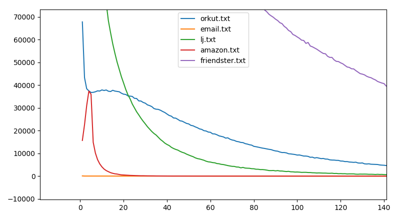
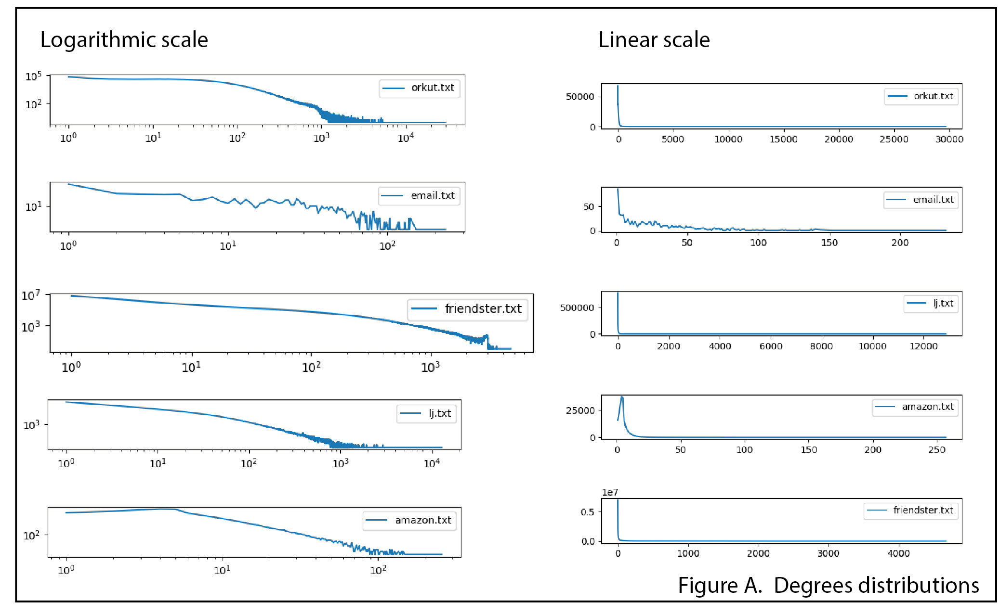

# Introduction to large graphs with C

We've been given 5 graphs. Three are small sized compared to the other two. The biggest of the five has almost 2 billions edges and will only fit on a at least a 30Gb disk.

## Getting started

In the context of this work, we assume graphs to be simple and undirected. The graphs you can download at http://snap.stanford.edu/data may contain duplicated edges or self-loops. Regarding to our purposes the first step is preprocessing the extracted archives. Although the work has already been done, the following compound commands

```bash
sed '/^#/d' \
	| awk '{if ($1 < $2) {print $1" "$2} else {print $2" "$1}}' \
	| sort -u
```

removes order constraints such that if `u v` and `v u` are both in the input file so they both become `u v` (if $u<v$) in order to be sorted and to filter duplicates.

### Quantities

Let $G=(V,E)$ the targeted graph.

As the data in now clean and easier to process, we would like to first check quantities as number of nodes, number of edges, number of nodes by degree … 

But also a special quantity : $Q_G=\sum_{\{u,v\}\in E}d_u\times d_v$

All these quantities are computed in `src/size_of_graph.c`. Depending of the `-D` flags passed while compiling, the macro `FILENAME` is expanded to the right target file. The number of nodes, number of edges and the degrees per node are computed all at once. For each line

```
u v
```

$d_u$ and $d_v$ are incremented (we choose to represent $d_i$, $i\in V$ as an array of which the size $|V|$).

To compute the special quantity above, we're reading the file a second time. While the first pass updated `gsize` given by reference to `size_of_graph(gsize_t *gsize)` which holds an array called `degrees` (the latter $(d_i)_{i\in V}$); the second pass is to iterate over every edge in the graph and to compute $d_u\times d_v$ by reading line by line the file again. As this quantity may becomes very large it's represented by the type `unsigned long long`.

The following table reports runing times, number of nodes, number of links, file sizes and the computed special quantities for all of the 5 graphs sorted by the graph's size.

| graph ($G$) | running time | file size |           $Q_G$ |   #nodes |     #links |
| ----------- | -----------: | --------: | --------------: | -------: | ---------: |
| EMAIL       |       0.02 s |   118.4 K |        88109182 |      986 |      16064 |
| AMAZON      |       0.33 s |      12 M |       103415531 |   334863 |     925872 |
| LJ          |      26.42 s |  478.32 M |    789000450609 |  3997962 |   34681189 |
| ORKUT       |         36 s |   1.647 G |  22292678512329 |  3072441 |  117185083 |
| FRIENDSTER  |    14 m 48 s |  30.142 G | 379856554324947 | 65608366 | 1806067135 |

### Degrees distribution

Otherwise we counted nodes per degree within $O(|V|)$ in time. Counting is done by increments while iterating over the nodes into an array indexed by the degrees. Therefore complexity in memory is $O(max_u d_u)$ more and this is acceptable.

As there is no second reading for the graph while computing degrees distribution, we get the results twice faster as the computing time is mainly reading the file. The FRIENDSTER graph requires 7 minutes and 32 seconds. The timing is done on the same computer as for the special quantities.

By plotting $y(d)=n_d$ where $d$ is the degree and $n_d$ the number of nodes of degree $d$, we figured out different patterns. Except for the FRIENDSTER graph, nodes with more than 120 connections are rare but there still is about 1000 nodes in the ORKUT graph with this many connections. One could normalize the distributions for better comparison but the main trend is that highly connected nodes are less in number than the low connected nodes.



If then we take a look at each graph one by one, every graph but AMAZON's has mostly nodes connected to one and only one other node. By sorting the degree by the number of nodes the AMAZON's graph has most nodes of degree 4. Plots with logarithmic scale (Figure A.) shows less sparse details on the distribution. The latter also shows highly connected nodes on the FRIENDSTER's graph.



## Holding graphs into Memory

On our laptops, either with SSD or HDD, accessing and reading files takes more time than reading the RAM memory. On modern laptops and with a modest  budget, one can get try to run the upcoming only with 4GB of RAM. Even if there will not be enough memory to put the whole graph, we can try to extract smaller features that holds into the memory. There is at least three common ways to write the structure of a graph :

* list of edges (in this case study this is the input we're given)
* adjacency matrix (worst case for memory $O(n^2)$ and imagine for instance $n\sim10^9$)
* adjacency lists (best candidate)

We've implemented all of the three structures and they all suits well for the EMAIL graph. We also already almost know the size for each of the graph for the first structure. Though, the adjancency matrix is really bad for very large graphs. Indeed, most of complex graphs are sparse and the adjacency matrix will mostly be zeros. Finally the adjacency list can be seen as a wishable compression of the edges list.

The three datastructures are implemented in `src/load_graph.c` and are ready to test. In order to test them pass to the compiler a suite of `-D` flags fitting to your needs. For instance