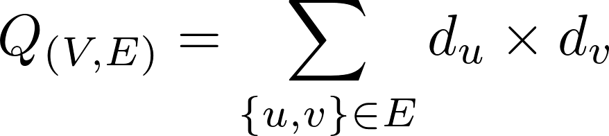

Handling Complex graphs in C
============================

The assignement text is availble here :
https://www-apr.lip6.fr/~buixuan/files/cpa2018/practicalMD_tme3.pdf

It have been proposed by
Maximilien Danisch, Clémence Magnien and Lionel Tabourier (lip6).


WIP
---

See [notes.md](notes.md).

Getting results
--------------

Read [`src/targets.h`](src/targets.h) first!

If you read `targets.h` you can understand why any command in the form
```
cc -D<TARGET> -D<PLATFORM> (-DESSENTIALS | -DDISTRIBUTIONS) size_of_graph.c
```
should produce a binary to produce the expected results.

Compilation with the flag `-DESSENTIALS` will produce a binary that computes the number of nodes, the number of links and the product of the degrees (mathematical equation below).

<p align=center>

</p

Targets are  `AMAZON`, `ORKUT`, `LJ`, `EMAIL` or `FRIENDSTER`.

Platforms are `LOCAL` (your laptop) and `PPTI` (CS platform reserved to SU students [(1)][1]).


### An example
To target `email-Eu-core.txt` on your laptop do
```
cc -DEMAIL -DLOCAL -DESSENTIALS size_of_graph.c && ./a.out # essential quantities
cc -DEMAIL -DLOCAL -DDISTRIBUTIONS size_of_graph.c && ./a.out # degree distribution (>0)
```


* The previous commands should be both run from `src`.
* The previous commands both assumes the file `email-Eu-core.txt` location is `../assets/clean`

### Cleaning targets

Targeted graphs may contain duplicate entries. If you're running the toolkit on files located on your laptop you better want to clean them first :

```
./clean.sh <$target >$clean

# for instance
# target = assets/email-Eu-core.txt
# clean = assets/clean/emai-Eu-core.txt
```

[1]: https://www-ppti.ufr-info-p6.jussieu.fr/index.php/support/connexions-distantes
